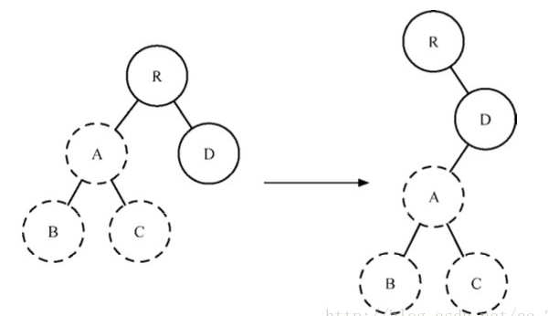
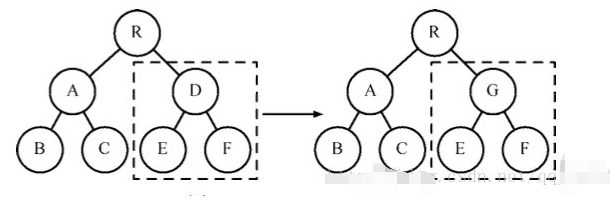
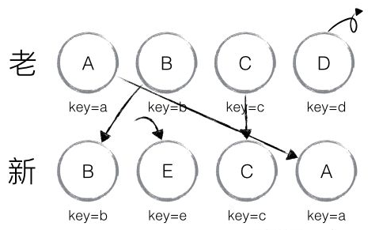

# Diff算法
#### 什么是Diff算法？
diff算法作为Virtual DOM的加速器，其算法的改进优化是React整个界面渲染的基础和性能的保障，同时也是React源码中最神秘的，最不可思议的部分

**传统Diff：**

计算一棵树形结构转换为另一棵树形结构需要最少步骤，如果使用传统的diff算法通过循环递归遍历节点进行对比，其复杂度要达到O(n^3)，其中n是节点总数，效率十分低下，假设我们要展示1000个节点，那么我们就要依次执行上十亿次的比较。

下面附上一则简单的传统diff算法：

```
let result = [];
// 比较叶子节点
const diffLeafs = function (beforeLeaf, afterLeaf) {
    // 获取较大节点树的长度
    let count = Math.max(beforeLeaf.children.length, afterLeaf.children.length);
    // 循环遍历
    for (let i = 0; i < count; i++) {
        const beforeTag = beforeLeaf.children[i];
        const afterTag = afterLeaf.children[i];
        // 添加 afterTag 节点
        if (beforeTag === undefined) {
            result.push({ type: "add", element: afterTag });
            // 删除 beforeTag 节点
        } else if (afterTag === undefined) {
            result.push({ type: "remove", element: beforeTag });
            // 节点名改变时，删除 beforeTag 节点，添加 afterTag 节点
        } else if (beforeTag.tagName !== afterTag.tagName) {
            result.push({ type: "remove", element: beforeTag });
            result.push({ type: "add", element: afterTag });
            // 节点不变而内容改变时，改变节点
        } else if (beforeTag.innerHTML !== afterTag.innerHTML) {
            if (beforeTag.children.length === 0) {
                result.push({
                    type: "changed",
                    beforeElement: beforeTag,
                    afterElement: afterTag,
                    html: afterTag.innerHTML
                });
            } else {
                // 递归比较
                diffLeafs(beforeTag, afterTag);
            }
        }
    }
    return result;
}
```
**React Diff算法优化策略图**


* React更新阶段会对ReactElement类型判断而进行不同的操作；ReactElement类型包含三种即：文本、Dom、组件；
* 每个类型的元素更新处理方式：
    * 自定义元素的更新，主要是更新render出的节点，做甩手掌柜交给render出的节点的对应component去管理更新。
    * text节点的更新很简单，直接更新文案。
    * 浏览器基本元素的更新，分为两块：
        * 更新属性，对比出前后属性的不同，局部更新。并且处理特殊属性，比如事件绑定。
        * 子节点的更新，子节点更新主要是找出差异对象，找差异对象的时候也会使用上面的shouldUpdateReactComponent来判断，如果是可以直接更新的就会递归调用子节点的更新,这样也会递归查找差异对象。不可直接更新的删除之前的对象或添加新的对象。之后根据差异对象操作dom元素（位置变动，删除，添加等）
    
### React中Diff算法的实现

**React Diff：**

之前说过，React采用虚拟DOM技术实现对真实DOM的映射，即React Diff算法的差异查找实质是对两个JavaScript对象的差异查找；

基于三个策略：

    1.Web UI中DOM节点跨层级的移动操作特别少，可以忽略不计。（tree diff）
    2.拥有相同类的两个组件将会生成相似的树形结构，拥有不同类的两个组件将会生成不同的树形结。（component diff）
    3.对于同一层级的一组子节点，它们可以通过唯一ID进行区分。（element diff）
##### 对于以上三个策略，react分别对tree diff,component diff,element diff进行算法优化。

##### 1.tree diff
基于策略一，WebUI中DOM节点跨层级的移动操作少的可以忽略不计，React对Virtual DOM树进行层级控制，只会对相同层级的DOM节点进行比较，即同一个父元素下的所有子节点，当发现节点已经不存在了，则会删除掉该节点下所有的子节点，不会再进行比较。这样只需要对DOM树进行一次遍历，就可以完成整个树的比较。复杂度变为O(n);

疑问：当我们的DOM节点进行跨层级操作时，diff会有怎么样的表现呢？

如下图所示，A节点及其子节点被整个移动到D节点下面去，```由于React只会简单的考虑同级节点的位置变换，而对于不同层级的节点，只有创建和删除操作，```所以当根节点发现A节点消失了，就会删除A节点及其子节点，当D发现多了一个子节点A，就会创建新的A作为其子节点。 
此时，diff的执行情况是：

```createA-->createB-->createC-->deleteA```



Tree DIFF是对树的每一层进行遍历，如果某组件不存在了，则会直接销毁。如图所示，左边是旧属，右边是新属，第一层是R组件，一模一样，不会发生变化；第二层进入Component DIFF，同一类型组件继续比较下去，发现A组件没有，所以直接删掉A、B、C组件；继续第三层，重新创建A、B、C组件。

由此可以发现，当出现节点跨层级移动时，并不会出现想象中的移动操作，而是会进行删除，重新创建的动作，这是一种很影响React性能的操作。因此官方也不建议进行DOM节点跨层级的操作。

##### 2.componnet diff
React是基于组件构建应用的，对于组件间的比较所采用的策略也是非常简洁和高效的。

* 如果是同一个类型的组件，则按照原策略进行Virtual DOM比较。

* 如果不是同一类型的组件，则将其判断为dirty component，从而替换整个组价下的所有子节点。

* 如果是同一个类型的组件，有可能经过一轮Virtual DOM比较下来，并没有发生变化。如果我们能够提前确切知道这一点，那么就可以省下大量的diff运算时间。因此，React允许用户通过shouldComponentUpdate()来判断该组件是否需要进行diff算法分析。

如下图所示，当组件D变为组件G时，即使这两个组件结构相似，```一旦React判断D和G是不用类型的组件，就不会比较两者的结构，而是直接删除组件D，重新创建组件G及其子节点。```虽然当两个组件是不同类型但结构相似时，进行diff算法分析会影响性能，但是毕竟不同类型的组件存在相似DOM树的情况在实际开发过程中很少出现，因此这种极端因素很难在实际开发过程中造成重大影响。 



##### 3.element diff
当节点属于同一层级时，diff提供了3种节点操作，分别为INSERT_MARKUP(插入)，MOVE_EXISTING(移动),REMOVE_NODE(删除)。

* INSERT_MARKUP:新的组件类型不在旧集合中，即全新的节点，需要对新节点进行插入操作。
* MOVE_EXISTING:旧集合中有新组件类型，且element是可更新的类型，这时候就需要做移动操作，可以复用以前的DOM节点。
* REMOVE_NODE:旧组件类型，在新集合里也有，但对应的element不同则不能直接复用和更新，需要执行删除操作，或者旧组件不在新集合里的，也需要执行删除操作。



Element DIFF紧接着以上统一类型组件继续比较下去，常见类型就是列表。同一个列表由旧变新有三种行为，插入、移动和删除，它的比较策略是对于每一个列表指定key，```先将所有列表遍历一遍，确定要新增和删除的，再确定需要移动的。```如图所示，第一步将D删掉，第二步增加E，再次执行时A和B只需要移动位置即可。


#### React中Diff算法实现的代码
```
_updateChildren: function(nextNestedChildrenElements, transaction, context) {
    var prevChildren = this._renderedChildren;
    var removedNodes = {};
    var mountImages = [];
    // 获取新的子元素数组
    var nextChildren = this._reconcilerUpdateChildren(
      prevChildren,
      nextNestedChildrenElements,
      mountImages,
      removedNodes,
      transaction,
      context
    );
    if (!nextChildren && !prevChildren) {
      return;
    }
    var updates = null;
    var name;
    var nextIndex = 0;
    var lastIndex = 0;
    var nextMountIndex = 0;
    var lastPlacedNode = null;
    for (name in nextChildren) {
      if (!nextChildren.hasOwnProperty(name)) {
        continue;
      }
      var prevChild = prevChildren && prevChildren[name];
      var nextChild = nextChildren[name];
      if (prevChild === nextChild) {
        // 同一个引用，说明是使用的同一个component,所以我们需要做移动的操作
        // 移动已有的子节点
        // NOTICE：这里根据nextIndex, lastIndex决定是否移动
        updates = enqueue(
          updates,
          this.moveChild(prevChild, lastPlacedNode, nextIndex, lastIndex)
        );
        // 更新lastIndex
        lastIndex = Math.max(prevChild._mountIndex, lastIndex);
        // 更新component的.mountIndex属性
        prevChild._mountIndex = nextIndex;
      } else {
        if (prevChild) {
          // 更新lastIndex
          lastIndex = Math.max(prevChild._mountIndex, lastIndex);
        }

        // 添加新的子节点在指定的位置上
        updates = enqueue(
          updates,
          this._mountChildAtIndex(
            nextChild,
            mountImages[nextMountIndex],
            lastPlacedNode,
            nextIndex,
            transaction,
            context
          )
        );
        nextMountIndex++;
      }
      // 更新nextIndex
      nextIndex++;
      lastPlacedNode = ReactReconciler.getHostNode(nextChild);
    }
    // 移除掉不存在的旧子节点，和旧子节点和新子节点不同的旧子节点
    for (name in removedNodes) {
      if (removedNodes.hasOwnProperty(name)) {
        updates = enqueue(
          updates,
          this._unmountChild(prevChildren[name], removedNodes[name])
        );
      }
    }
  }
  ```

### 基于中Diff的开发建议

**基于tree diff：**
* 开发组件时，注意保持DOM结构的稳定；即，尽可能少地动态操作DOM结构，尤其是移动操作。
* 当节点数过大或者页面更新次数过多时，页面卡顿的现象会比较明显。
* 这时可以通过 CSS 隐藏或显示节点，而不是真的移除或添加 DOM 节点。

**基于component diff：**
* 注意使用 shouldComponentUpdate() 来减少组件不必要的更新。
* 对于类似的结构应该尽量封装成组件，既减少代码量，又能减少component diff的性能消耗。

**基于element diff：**
* 对于列表结构，尽量减少类似将最后一个节点移动到列表首部的操作，当节点数量过大或更新操作过于频繁时，在一定程度上会影响 React 的渲染性能。